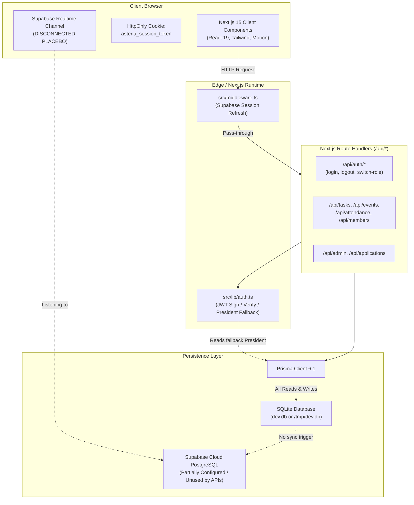

# Asteria Club Esprit — Full Project Technical Audit Report

**Platform:** Asteria Club Esprit (Internal Operating System & Talent Incubator)  
**Corpus / Repository:** `itshydraaaaaa/Asteria-Club-Esprit`  
**Workspace Path:** `c:\Users\MSI\Downloads\Asteria\Asteria Club`  
**Audit Date:** September 2026  
**Auditor Roles:** Senior Software Architect, Senior Full-Stack Engineer, Security Engineer, Database Engineer, DevOps Engineer, QA Engineer, Code Auditor  
**Audit Completion Status:** **COMPLETE**

---

## Table of Contents

1. [Executive Summary](#1-executive-summary)
2. [Overall Project Health Score](#2-overall-project-health-score)
3. [Architecture Overview](#3-architecture-overview)
4. [Technology Stack](#4-technology-stack)
5. [Project Directory & File Structure](#5-project-directory--file-structure)
6. [Critical Application Flows](#6-critical-application-flows)
7. [Critical Issues Catalog (P0 to P4)](#7-critical-issues-catalog-p0-to-p4)
8. [Hardcoded Values Audit Summary](#8-hardcoded-values-audit-summary)
9. [Static, Fake & Placeholder Data Findings](#9-static-fake--placeholder-data-findings)
10. [Dead Code & Unused Modules Findings](#10-dead-code--unused-modules-findings)
11. [Code Duplication Findings](#11-code-duplication-findings)
12. [Database Architecture Findings](#12-database-architecture-findings)
13. [Database Query & Performance Findings](#13-database-query--performance-findings)
14. [Authentication Findings](#14-authentication-findings)
15. [Authorization & RBAC Findings](#15-authorization--rbac-findings)
16. [Security Findings (OWASP Top 10 Alignment)](#16-security-findings-owasp-top-10-alignment)
17. [Frontend Architecture & UI Logic Findings](#17-frontend-architecture--ui-logic-findings)
18. [Backend & API Route Handlers Findings](#18-backend--api-route-handlers-findings)
19. [DevOps, Build & Deployment Findings](#19-devops-build--deployment-findings)
20. [Testing & Quality Assurance Findings](#20-testing--quality-assurance-findings)
21. [Accessibility (a11y), SEO & UX Findings](#21-accessibility-a11y-seo--ux-findings)
22. [Scalability & Concurrency Bottlenecks](#22-scalability--concurrency-bottlenecks)
23. [Production Risks Summary](#23-production-risks-summary)
24. [Quick Wins](#24-quick-wins)
25. [Refactoring Roadmap (Phases 0 to 5)](#25-refactoring-roadmap-phases-0-to-5)
26. [Technical Debt Register](#26-technical-debt-register)
27. [Files Recommended for Deletion](#27-files-recommended-for-deletion)
28. [Files Recommended for Refactoring](#28-files-recommended-for-refactoring)
29. [Missing Features & Missing Safeguards](#29-missing-features--missing-safeguards)
30. [Production Launch Checklist](#30-production-launch-checklist)
31. [Final Recommendations & Sign-Off](#31-final-recommendations--sign-off)

---

## 1. Executive Summary

**Asteria Club Esprit** is designed as a student operating system and talent pipeline for ESPRIT University's creative and technical club across four core specialization tracks: *Web Development*, *Graphic Design*, *Video Editing*, and *Photography*. The system provides an agile Kanban sprint board, QR attendance verification, a shared calendar with RSVPs, department hubs, public recruitment forms, member profiles, and an executive administration console.

### Key Audit Conclusions
While the frontend demonstrates exceptional visual craftsmanship—strictly implementing the **Asteria Charte Graphique 2026 (v2.1)** with Tailwind CSS, custom fonts (Exo 2, Plus Jakarta Sans, JetBrains Mono), Three.js particle backgrounds, and full English/French bilingual internationalization—the **backend architecture, authentication layer, database configuration, and deployment setup suffer from critical structural deficiencies**:

1. **Catastrophic Build-Time Data Loss Pipeline**: The `package.json` build command (`"build": "prisma generate && prisma db push --accept-data-loss && tsx prisma/seed.ts && next build"`) executes `seed.ts` on every production build, purging all database tables (`deleteMany()`) and destroying all real user data, applications, and task records upon deployment.
2. **Total Authentication Bypass (President Fallback)**: In `src/lib/auth.ts`, if an incoming HTTP request lacks a session cookie, `getCurrentUser()` automatically returns the first Executive Board user (`role: "BOARD"` / President). Any anonymous visitor accessing the platform is automatically granted full presidential superuser access.
3. **Unauthenticated Privilege Escalation Backdoor**: The `/api/auth/switch-role` endpoint accepts arbitrary target roles or emails and mints valid authentication cookies with zero authorization, password verification, or environment gating. Furthermore, `PATCH /api/members/[id]` permits anyone on the public internet to arbitrarily reassign any user's role to `"BOARD"`.
4. **Credential & Password Hash Leakage**: Multiple endpoints (`GET /api/departments/[id]`, `PATCH /api/members/[id]`, `POST /api/events`, `POST /api/events/[id]/rsvp`, `POST /api/tasks`, `PATCH /api/tasks/[id]`) execute unprojected Prisma queries (`include: { members: true, createdBy: true, assignee: true }`), returning users' bcrypt `passwordHash` in plaintext JSON responses.
5. **Architectural Database Dichotomy & State Ephemerality**: The system is split between an unused Supabase PostgreSQL schema (`supabase/migrations/20260228_initial_schema.sql`) and a local SQLite database (`prisma/dev.db`). In serverless environments (Vercel/AWS Lambda), `src/lib/db.ts` copies SQLite to `/tmp/dev.db`, making all database writes ephemeral, non-shared, and lost upon Lambda instance recycling.
6. **Placebo Realtime & External Integrations**: The frontend subscribes to Supabase Realtime channels (`tasks_realtime`, `attendance_realtime`, `announcements_realtime`), but database writes target SQLite, meaning real-time events never fire. Similarly, "Discord Sync" is a static UI simulation without any webhook execution.
7. **Complete Absence of Automated Tests**: The repository contains zero unit, integration, E2E, or security tests.

---

## 2. Overall Project Health Score

| Dimension | Score (0–100) | Rating | Primary Root Cause |
| :--- | :---: | :---: | :--- |
| **Architecture** | **38/100** | Critical Risk | Dual database dichotomy (Prisma SQLite vs Supabase Postgres), ephemeral `/tmp` storage, broken realtime sync. |
| **Frontend** | **84/100** | Good | Polished brand styling, responsive design, dark/light theme, bilingual i18n; monolithic home page. |
| **Backend** | **35/100** | Critical Risk | Missing authentication middleware, massive IDOR vulnerabilities, uncontrolled mutation endpoints. |
| **Database** | **32/100** | Critical Risk | SQLite hardcoded in schema, missing foreign key indexes, string-typed enums, missing check constraints. |
| **Security** | **18/100** | Severe Risk | Auth bypass fallback, unauthenticated role switching, password hash leakage, lack of rate limiting. |
| **Performance** | **55/100** | Moderate | Unbatched N+1 sequential count queries in dashboard, large JS bundle (`gsap` unused, Three.js). |
| **Code Quality** | **58/100** | Moderate | Rampant `: any` typing, swallowed errors, duplicated dashboard aggregation queries. |
| **Testing** | **0/100** | Failed | Zero test suites, zero test frameworks configured. |
| **DevOps** | **25/100** | Severe Risk | Build script resets database with seed data, no CI/CD pipelines, no Docker containerization. |
| **Scalability** | **20/100** | Severe Risk | Single-file SQLite on serverless Lambda cannot scale beyond 1 concurrent write instance. |
| **Production Readiness** | **15/100** | **NOT READY** | Immediate data loss and security compromise will occur upon public deployment. |

**Aggregate System Health Index: 34.5 / 100 (NOT PRODUCTION READY)**

---

## 3. Architecture Overview

### Communication Flow



### Architectural Discrepancies
* **API to Database**: 100% of internal API handlers query SQLite via Prisma (`prisma.task`, `prisma.user`, `prisma.event`, etc.).
* **Frontend to Supabase**: Frontend components (`KanbanBoard.tsx`, `AttendanceHub.tsx`, `AnnouncementsFeed.tsx`) establish WebSocket connections to Supabase Realtime for `postgres_changes`. Because mutations write to SQLite, Supabase never emits events, resulting in silent realtime failure.
* **Authentication**: Login attempts Supabase Auth first; if no user exists, it authenticates against Prisma SQLite and sets an `asteria_session_token` cookie. However, `getCurrentUser()` defaults to returning the President if that cookie is missing.

---

## 4. Technology Stack

* **Core Framework**: Next.js `16.3.3` / `15.1.0` (App Router, Server & Client Components)
* **Frontend Runtime**: React `19.0.0`, React DOM `19.0.0`
* **Programming Language**: TypeScript `5.7.2` (Strict Mode enabled in `tsconfig.json`)
* **Styling & CSS**: Tailwind CSS `3.4.16`, PostCSS `8.4.49`, Autoprefixer `10.4.20`, `clsx` `2.1.1`, `tailwind-merge` `2.5.5`
* **Database & ORM**: Prisma ORM `6.1.0`, SQLite (`prisma/dev.db`), Supabase PostgreSQL (migration script only)
* **Authentication**: Custom JWT (`jsonwebtoken` `9.0.2`), `bcryptjs` `2.4.3`, Supabase SSR (`@supabase/ssr` `0.12.5`, `@supabase/supabase-js` `2.112.4`)
* **Animation & Graphics**: Three.js `0.185.1`, Lenis `1.3.26`, Framer Motion `13.1.1`, Canvas Confetti `1.9.4`
* **Icons & Utility**: `lucide-react` `0.468.0`, `qrcode` `1.5.4`
* **Runtime Execution**: `tsx` `4.19.2` (for seed execution)
* **Unused Dependencies**: `gsap` `3.15.0`

---

## 5. Project Directory & File Structure

```
Asteria Club/
├── .env                                  # Local env variables (Supabase URL, Anon Key, Service Role Key, JWT Secret)
├── .env.example                          # Environment configuration template
├── .env.local                            # Redundant local env mirror
├── .gitignore                            # Git ignore rules (node_modules, .env, dev.db)
├── DOCUMENTATION.md                      # Comprehensive project documentation
├── README.md                             # Project overview & demo accounts
├── SETUP.md                              # Setup instructions
├── next-env.d.ts                         # Next.js TypeScript declarations
├── next.config.ts                        # Next.js build configuration
├── package.json                          # Dependencies and build scripts
├── package-lock.json                     # Dependency lockfile
├── postcss.config.mjs                    # PostCSS Tailwind plugins
├── tailwind.config.ts                    # Custom design tokens, colors, animations
├── tsconfig.json                         # TypeScript compiler configuration
├── prisma/
│   ├── dev.db                            # Active SQLite database file (139 KB)
│   ├── schema.prisma                     # Prisma schema (SQLite datasource)
│   └── seed.ts                           # Database destructive seeding script
├── public/
│   ├── asteria-wave-logo.png             # Official brand wave crest
│   └── logo.png                          # Club logo asset
├── src/
│   ├── middleware.ts                     # Next.js root request middleware
│   ├── app/
│   │   ├── globals.css                   # Global styles & CSS variables
│   │   ├── layout.tsx                    # Root HTML layout with providers & fonts
│   │   ├── page.tsx                      # Public landing homepage (742 lines)
│   │   ├── apply/page.tsx                # Public recruitment application portal
│   │   ├── login/page.tsx                # Member login screen
│   │   ├── signup/page.tsx               # Membership info & redirect to apply
│   │   ├── robots.ts                     # SEO robots configuration
│   │   ├── sitemap.ts                    # SEO XML sitemap generator
│   │   ├── (dashboard)/
│   │   │   ├── layout.tsx                # Authenticated dashboard wrapper
│   │   │   ├── dashboard/page.tsx        # Role-tailored dashboard screen
│   │   │   ├── tasks/page.tsx            # Agile sprint Kanban board page
│   │   │   ├── attendance/page.tsx       # QR check-in & verification page
│   │   │   ├── calendar/page.tsx         # Event schedule & RSVP page
│   │   │   ├── departments/page.tsx      # Department list & Org Chart page
│   │   │   ├── departments/[id]/page.tsx # Department detail hub
│   │   │   ├── members/page.tsx          # Member directory search page
│   │   │   ├── members/[id]/page.tsx     # Member dossier & edit profile page
│   │   │   ├── announcements/page.tsx    # Bulletins & announcements feed
│   │   │   ├── applications/page.tsx     # Recruitment applicant review portal
│   │   │   └── admin/page.tsx            # Executive administration & cycle page
│   │   └── api/
│   │       ├── admin/route.ts            # Admin stats & cycle management
│   │       ├── announcements/route.ts    # Announcements GET / POST
│   │       ├── applications/route.ts     # Public application submission & review
│   │       ├── applications/[id]/route.ts# Application status update
│   │       ├── applications/[id]/onboard/route.ts # 1-click auto-onboarding
│   │       ├── attendance/route.ts       # Attendance records & audit stats
│   │       ├── attendance/check-in/route.ts # QR / passcode check-in
│   │       ├── attendance/justify/route.ts  # Absence justification
│   │       ├── auth/login/route.ts       # User login handler
│   │       ├── auth/logout/route.ts      # User logout handler
│   │       ├── auth/me/route.ts          # Session user resolution
│   │       ├── auth/switch-role/route.ts # Demo role switcher (VULNERABLE)
│   │       ├── dashboard/route.ts        # Dashboard metrics aggregation
│   │       ├── departments/route.ts      # Department list
│   │       ├── departments/[id]/route.ts # Department detail (VULNERABLE)
│   │       ├── departments/org-chart/route.ts # Org chart hierarchy
│   │       ├── events/route.ts           # Events schedule GET / POST
│   │       ├── events/[id]/rsvp/route.ts # RSVP management
│   │       ├── members/route.ts          # Member directory query
│   │       ├── members/[id]/route.ts     # Member profile & update (VULNERABLE)
│   │       ├── stats/route.ts            # Public platform KPIs
│   │       ├── tasks/route.ts            # Kanban tasks GET / POST
│   │       ├── tasks/[id]/route.ts       # Task PATCH / DELETE
│   │       └── tasks/[id]/comments/route.ts # Threaded task comments
│   ├── components/
│   │   ├── announcements/AnnouncementsFeed.tsx
│   │   ├── attendance/AttendanceHub.tsx
│   │   ├── brand/AsteriaLogo.tsx
│   │   ├── calendar/CalendarView.tsx
│   │   ├── dashboard/BoardDashboard.tsx
│   │   ├── dashboard/HoDDashboard.tsx
│   │   ├── dashboard/MemberDashboard.tsx
│   │   ├── dashboard/PlatformGuideModal.tsx
│   │   ├── kanban/KanbanBoard.tsx
│   │   ├── layout/Header.tsx
│   │   ├── layout/MobileNav.tsx
│   │   ├── layout/RoleSwitcherBar.tsx
│   │   ├── layout/Sidebar.tsx
│   │   ├── org-chart/OrgChartView.tsx
│   │   ├── providers/LanguageProvider.tsx
│   │   ├── providers/SmoothScrollProvider.tsx
│   │   ├── providers/ThemeProvider.tsx
│   │   ├── recruitment/ApplicationsPipeline.tsx
│   │   └── ui/ (AmbientCanvas, AnimatedCounter, Avatar, Badge, Button, Card, EmptyState, Input, LanguageToggle, Modal, Select, Skeleton, Tabs, ThemeToggle)
│   └── lib/
│       ├── auth.ts                       # JWT utilities & session resolver
│       ├── db.ts                         # Prisma client initialization & SQLite /tmp copy
│       ├── motion.ts                     # Motion tokens (UNUSED)
│       ├── types.ts                      # Shared TypeScript data models
│       ├── utils.ts                      # Utility functions (cn, formatDate)
│       ├── i18n/translations.ts          # Bilingual EN/FR dictionary (653 lines)
│       └── supabase/                     # Supabase SSR client, middleware, server, types
└── supabase/
    └── migrations/20260228_initial_schema.sql # PostgreSQL schema & RLS policies
```

---

## 6. Critical Application Flows

### Flow 1: Authentication & Session Verification
1. User enters email and password on `/login`.
2. Browser sends `POST /api/auth/login`.
3. Handler verifies credentials using `bcrypt.compare` against `prisma.user.findUnique`.
4. Handler signs a JWT with `signToken` and sets HttpOnly cookie `asteria_session_token`.
5. **Vulnerability**: If cookie is missing or cleared, `getCurrentUser()` queries `prisma.user.findFirst({ where: { role: "BOARD" } })` and returns the President user object.

### Flow 2: Recruitment & Auto-Onboarding
1. Prospective student fills form on `/apply`.
2. `POST /api/applications` stores application with status `"PENDING"`.
3. Board member opens `/applications` and clicks "1-Click Auto-Onboard".
4. `POST /api/applications/[id]/onboard` generates random password `Ast_${randomBytes}!`, hashes it with bcrypt, and upserts `prisma.user`.
5. **Flaw**: The generated password is never emailed or displayed to the user or admin, leaving the created account locked unless reset.

### Flow 3: Attendance Check-In Verification
1. Event host projects QR code or numeric passcode on screen at `/attendance`.
2. Member enters code or clicks simulate button, triggering `POST /api/attendance/check-in`.
3. Handler matches code with `prisma.event.findFirst({ where: { checkInCode: code } })`.
4. **Flaw**: `GET /api/events` exposes `checkInCode` publicly to anyone without authentication. Anyone can check into any session without attending.

### Flow 4: Agile Sprint Kanban Delivery
1. Team members view `/tasks`.
2. Tasks are loaded via `GET /api/tasks`.
3. Moving a card triggers `PATCH /api/tasks/[id]` with new status.
4. **Flaw**: No authorization check prevents members from modifying tasks assigned to other departments or members.

---

## 7. Critical Issues Catalog (P0 to P4)

### [P0-01] Production Build Database Destruction via Seed Script
* **Severity**: P0 — Critical
* **Category**: DevOps / Data Integrity
* **Files**: [`package.json`](file:///c:/Users/MSI/Downloads/Asteria/Asteria%20Club/package.json#L7), [`prisma/seed.ts`](file:///c:/Users/MSI/Downloads/Asteria/Asteria%20Club/prisma/seed.ts#L7-L19)
* **Description**: `package.json` defines `"build": "prisma generate && prisma db push --accept-data-loss && tsx prisma/seed.ts && next build"`. On lines 7–19 of `prisma/seed.ts`, `prisma.$deleteMany()` executes against every table.
* **Impact**: Every time the application is deployed on Vercel or rebuilt in production, all production data (users, tasks, attendance records, applications) is permanently erased.
* **How to Verify**: Run `npm run build` locally. Inspect database counts before and after. All previously inserted records are wiped and replaced with seed data.
* **Recommended Fix**: Remove `prisma db push --accept-data-loss && tsx prisma/seed.ts` from `"build"`. Create an isolated `"db:seed"` script for local development only. Use `prisma migrate deploy` for production migrations.
* **Estimated Complexity**: Low (1 hour).
* **Dependencies**: None.

---

### [P0-02] Default Executive Board Authentication Bypass
* **Severity**: P0 — Critical
* **Category**: Authentication / Access Control
* **Files**: [`src/lib/auth.ts`](file:///c:/Users/MSI/Downloads/Asteria/Asteria%20Club/src/lib/auth.ts#L31-L42), [`src/app/api/auth/me/route.ts`](file:///c:/Users/MSI/Downloads/Asteria/Asteria%20Club/src/app/api/auth/me/route.ts#L60-L64)
* **Description**: When `getCurrentUser()` finds no valid JWT session token in cookies, it executes:
  ```typescript
  if (!token) {
    const defaultUser = await prisma.user.findFirst({
      where: { role: "BOARD" },
      include: { department: true, boardSeat: true },
    });
    return defaultUser;
  }
  ```
* **Impact**: Every unauthenticated visitor to the website is automatically granted full Executive Board (President) administrative rights across all API endpoints and dashboard views.
* **How to Verify**: Clear all browser cookies and visit `/dashboard`, `/admin`, or send `GET /api/admin`. The response succeeds with 200 OK under President identity.
* **Recommended Fix**: Return `null` immediately when `token` is missing or invalid. Restrict demo/guest switching strictly to non-production environments behind an explicit mock adapter.
* **Estimated Complexity**: Low (2 hours).
* **Dependencies**: RoleSwitcherBar.

---

### [P0-03] Unauthenticated Privilege Escalation & Role Switching Backdoor
* **Severity**: P0 — Critical
* **Category**: Authentication / Authorization
* **Files**: [`src/app/api/auth/switch-role/route.ts`](file:///c:/Users/MSI/Downloads/Asteria/Asteria%20Club/src/app/api/auth/switch-role/route.ts#L5-L87)
* **Description**: The `/api/auth/switch-role` endpoint accepts `{ targetRole: "BOARD" }` or `{ email: "president@asteria.tn" }` via HTTP POST and immediately signs and returns a session cookie for that user without password verification or environment validation.
* **Impact**: Any external user or automated script can forge authenticated sessions for the President, HoD, or any member in production with a single curl command.
* **How to Verify**: Execute `curl -X POST http://localhost:3000/api/auth/switch-role -H "Content-Type: application/json" -d '{"targetRole":"BOARD"}' -i`. A valid `asteria_session_token` cookie is returned.
* **Recommended Fix**: Completely disable or remove this route in production (`if (process.env.NODE_ENV === "production" || process.env.NEXT_PUBLIC_DEMO_MODE !== "true") return NextResponse.json({ error: "Disabled" }, { status: 403 })`).
* **Estimated Complexity**: Low (1 hour).
* **Dependencies**: None.

---

### [P0-04] Plaintext Password Hash Leakage in API Responses
* **Severity**: P0 — Critical
* **Category**: Information Disclosure / Security
* **Files**:
  * [`src/app/api/departments/[id]/route.ts`](file:///c:/Users/MSI/Downloads/Asteria/Asteria%20Club/src/app/api/departments/%5Bid%5D/route.ts#L15-L23) (lines 15, 16, 21, 22)
  * [`src/app/api/members/[id]/route.ts`](file:///c:/Users/MSI/Downloads/Asteria/Asteria%20Club/src/app/api/members/%5Bid%5D/route.ts#L110) (line 110)
  * [`src/app/api/events/route.ts`](file:///c:/Users/MSI/Downloads/Asteria/Asteria%20Club/src/app/api/events/route.ts#L134) (line 134)
  * [`src/app/api/events/[id]/rsvp/route.ts`](file:///c:/Users/MSI/Downloads/Asteria/Asteria%20Club/src/app/api/events/%5Bid%5D/rsvp/route.ts#L38) (line 38)
  * [`src/app/api/tasks/route.ts`](file:///c:/Users/MSI/Downloads/Asteria/Asteria%20Club/src/app/api/tasks/route.ts#L85) (line 85)
  * [`src/app/api/tasks/[id]/route.ts`](file:///c:/Users/MSI/Downloads/Asteria/Asteria%20Club/src/app/api/tasks/%5Bid%5D/route.ts#L32-L37) (lines 32, 33, 36)
* **Description**: Prisma relation includes (`include: { members: true, createdBy: true, assignee: true, user: true }`) without explicit `select` projections return all model columns, including `passwordHash`.
* **Impact**: Unauthenticated visitors querying `/api/departments/[id]` receive the bcrypt hashes of all department members and the HoD, enabling offline dictionary/hashcat attacks.
* **How to Verify**: Send `GET /api/departments/web-development`. Inspect the returned JSON payload under `department.members[0].passwordHash`.
* **Recommended Fix**: Add explicit `select` blocks to all user relations omitting `passwordHash`, or use Prisma client extensions (`prisma.$extends`) to automatically strip `passwordHash` from all query results.
* **Estimated Complexity**: Medium (4 hours).
* **Dependencies**: All affected routes.

---

### [P0-05] Unauthenticated Public User Modification & Role Elevation
* **Severity**: P0 — Critical
* **Category**: Broken Object Level Authorization (BOLA / IDOR)
* **Files**: [`src/app/api/members/[id]/route.ts`](file:///c:/Users/MSI/Downloads/Asteria/Asteria%20Club/src/app/api/members/%5Bid%5D/route.ts#L87-L117)
* **Description**: The `PATCH /api/members/[id]` handler performs zero authentication checks (`getCurrentUser()` is not called). It accepts `{ role: "BOARD", freelanceReady: true, status: "ACTIVE" }` and updates the user directly.
* **Impact**: Anyone on the internet can change any user's role to `"BOARD"`, alter their profile details, or activate/deactivate accounts.
* **How to Verify**: Send `PATCH /api/members/<any-member-id>` with `{"role":"BOARD"}` without any cookies. Query the member; their role is now `"BOARD"`.
* **Recommended Fix**: Add strict authentication and authorization checks: users may only edit their own profile bio/skills, while role/status updates require `user.role === "BOARD"`.
* **Estimated Complexity**: Medium (2 hours).
* **Dependencies**: `auth.ts`.

---

### [P0-06] Ephemeral Database in Serverless Production Environments
* **Severity**: P0 — Critical
* **Category**: Architecture / Reliability
* **Files**: [`src/lib/db.ts`](file:///c:/Users/MSI/Downloads/Asteria/Asteria%20Club/src/lib/db.ts#L11-L36), [`prisma/schema.prisma`](file:///c:/Users/MSI/Downloads/Asteria/Asteria%20Club/prisma/schema.prisma#L1-L4)
* **Description**: On Vercel serverless deployments, `src/lib/db.ts` copies `prisma/dev.db` to `/tmp/dev.db`. Serverless `/tmp` directories are isolated per container instance and destroyed upon container shutdown.
* **Impact**: Writes made by one user are invisible to other users on different Lambda instances and vanish entirely when instances recycle.
* **How to Verify**: Deploy to Vercel. Create a task. Refresh or access from a different network/browser; data is inconsistent or missing.
* **Recommended Fix**: Migrate datasource provider in `schema.prisma` from `"sqlite"` to `"postgresql"` using the Supabase transaction pooler URL (`DATABASE_URL`).
* **Estimated Complexity**: High (8 hours).
* **Dependencies**: Supabase database configuration.

---

### [P1-01] Hardcoded JWT Secret & Public Secret Exposure
* **Severity**: P1 — High
* **Category**: Cryptographic Failure / Secret Management
* **Files**: [`src/lib/auth.ts`](file:///c:/Users/MSI/Downloads/Asteria/Asteria%20Club/src/lib/auth.ts#L6), [`.env.example`](file:///c:/Users/MSI/Downloads/Asteria/Asteria%20Club/.env.example#L17)
* **Description**: `const JWT_SECRET = process.env.JWT_SECRET || "asteria-super-secret-jwt-key-2026"`. The default fallback string is publicly published in documentation and git history.
* **Impact**: Attackers can forge valid JWT tokens for arbitrary user IDs and roles without database access.
* **Recommended Fix**: Throw a fatal error on server startup if `process.env.JWT_SECRET` is missing or equal to the default fallback string.
* **Estimated Complexity**: Low (1 hour).

---

### [P1-02] Hardcoded Supabase Credentials in Client Bundle
* **Severity**: P1 — High
* **Category**: Secret Management / Configuration
* **Files**: [`src/lib/supabase/client.ts`](file:///c:/Users/MSI/Downloads/Asteria/Asteria%20Club/src/lib/supabase/client.ts#L4-L5)
* **Description**: `DEFAULT_SUPABASE_URL` and `DEFAULT_SUPABASE_ANON_KEY` are hardcoded directly in client code:
  `const DEFAULT_SUPABASE_ANON_KEY = "sb_publishable_CslYLGLgxIk7b_UZEPasIA_iPquc6r9";`
* **Impact**: Exposes backend infrastructure configuration in compiled client JavaScript chunks.
* **Recommended Fix**: Require `process.env.NEXT_PUBLIC_SUPABASE_URL` and `process.env.NEXT_PUBLIC_SUPABASE_ANON_KEY` without fallbacks.
* **Estimated Complexity**: Low (1 hour).

---

### [P1-03] Check-In Passcode Enumeration & Public Code Leak
* **Severity**: P1 — High
* **Category**: Security / Broken Business Logic
* **Files**: [`src/app/api/events/route.ts`](file:///c:/Users/MSI/Downloads/Asteria/Asteria%20Club/src/app/api/events/route.ts#L64), [`src/app/api/attendance/check-in/route.ts`](file:///c:/Users/MSI/Downloads/Asteria/Asteria%20Club/src/app/api/attendance/check-in/route.ts#L20-L30)
* **Description**: `GET /api/events` is public and returns all event fields including `checkInCode`. Furthermore, `check-in/route.ts` allows check-in with just `{ eventId }` bypassing code entry completely, and codes generated via `Math.random()` (`AST-XXXX`) have only 9,000 possibilities with zero rate limiting.
* **Impact**: Any user can check in to any past or future event without attending.
* **Recommended Fix**: Exclude `checkInCode` from public event listings (only return to event creators/HoDs/Board). Enforce time-window verification (event must be active currently) and require valid codes.
* **Estimated Complexity**: Medium (3 hours).

---

### [P1-04] Auto-Onboarding Generates Unrecoverable Passwords
* **Severity**: P1 — High
* **Category**: Business Logic / Authentication
* **Files**: [`src/app/api/applications/[id]/onboard/route.ts`](file:///c:/Users/MSI/Downloads/Asteria/Asteria%20Club/src/app/api/applications/%5Bid%5D/onboard/route.ts#L38-L41)
* **Description**: Line 38 generates a random temporary password:
  `const secureTemporaryPassword = "Ast_" + crypto.randomBytes(12).toString("base64url") + "!";`
  The password is hashed and stored, but neither returned in the response nor sent via email.
* **Impact**: Onboarded recruits cannot log in to their provisioned accounts.
* **Recommended Fix**: Return an activation link or initial temporary password in the response, or implement transactional email onboarding.
* **Estimated Complexity**: Medium (4 hours).

---

### [P1-05] Complete Absence of Rate Limiting
* **Severity**: P1 — High
* **Category**: Denial of Service / Brute Force
* **Files**: All route handlers under `src/app/api/`
* **Description**: No rate limiting exists on `/api/auth/login`, `/api/attendance/check-in`, `/api/applications`, or `/api/tasks`.
* **Impact**: Susceptible to credential stuffing, passcode brute-forcing, and spam denial of service.
* **Recommended Fix**: Implement rate limiting middleware using an in-memory token bucket or Upstash Redis.
* **Estimated Complexity**: Medium (4 hours).

---

### [P2-01] Missing Inactive/Alumni Account Restrictions
* **Severity**: P2 — Medium
* **Category**: Authorization / Lifecycle
* **Files**: [`src/lib/auth.ts`](file:///c:/Users/MSI/Downloads/Asteria/Asteria%20Club/src/lib/auth.ts#L69-L100)
* **Description**: `getCurrentUser()` does not check if `user.status === "ACTIVE"`. Users marked as `"INACTIVE"` or `"ALUMNI"` retain full access.
* **Impact**: Deactivated members can still perform actions and access internal resources.
* **Recommended Fix**: Deny authorization or reject token verification if `user.status !== "ACTIVE"`.
* **Estimated Complexity**: Low (1 hour).

---

### [P2-02] Unchecked Absence Auto-Excuse Vulnerability
* **Severity**: P2 — Medium
* **Category**: Business Logic
* **Files**: [`src/app/api/attendance/justify/route.ts`](file:///c:/Users/MSI/Downloads/Asteria/Asteria%20Club/src/app/api/attendance/justify/route.ts#L21-L40)
* **Description**: Submitting an absence justification immediately updates status to `"EXCUSED"` without requiring HoD or Board review.
* **Impact**: Members can unilaterally erase unexcused absences.
* **Recommended Fix**: Set status to `"PENDING_JUSTIFICATION"` and create an approval queue for department leads.
* **Estimated Complexity**: Medium (3 hours).

---

### [P2-03] Serial N+1 Query Aggregation in Dashboard
* **Severity**: P2 — Medium
* **Category**: Performance / Database
* **Files**: [`src/app/api/dashboard/route.ts`](file:///c:/Users/MSI/Downloads/Asteria/Asteria%20Club/src/app/api/dashboard/route.ts#L12-L21)
* **Description**: Executes 8 unbatched sequential `count()` queries on every dashboard load.
* **Impact**: High database roundtrip latency under concurrent load.
* **Recommended Fix**: Combine into a single `prisma.$transaction([ ... ])` or execute parallel queries via `Promise.all`.
* **Estimated Complexity**: Low (1 hour).

---

### [P2-04] Insecure Cookies Missing `secure: true` Flag
* **Severity**: P2 — Medium
* **Category**: Security / Session Management
* **Files**: [`src/app/api/auth/login/route.ts`](file:///c:/Users/MSI/Downloads/Asteria/Asteria%20Club/src/app/api/auth/login/route.ts#L93-L100)
* **Description**: Cookies set `httpOnly: true`, `sameSite: "lax"`, but omit `secure: process.env.NODE_ENV === "production"`.
* **Impact**: Session cookies can be transmitted over unencrypted HTTP connections.
* **Recommended Fix**: Add `secure: process.env.NODE_ENV === "production"`.
* **Estimated Complexity**: Low (15 mins).

---

### [P3-01] Monolithic Landing Page Component (`src/app/page.tsx`)
* **Severity**: P3 — Low
* **Category**: Maintainability / Code Quality
* **Files**: [`src/app/page.tsx`](file:///c:/Users/MSI/Downloads/Asteria/Asteria%20Club/src/app/page.tsx#L1-L742)
* **Description**: `page.tsx` is 742 lines long, combining hero, tracks, methodology, FAQ, stats, and footer into one client component.
* **Impact**: Large client bundle, degraded re-render performance, poor maintainability.
* **Recommended Fix**: Decompose into modular subcomponents (`HeroSection`, `TracksGrid`, `FaqAccordion`, `Footer`).
* **Estimated Complexity**: Medium (4 hours).

---

### [P3-02] Inconsistent Freelance Readiness Threshold
* **Severity**: P3 — Low
* **Category**: Business Logic Consistency
* **Files**: [`src/components/dashboard/MemberDashboard.tsx`](file:///c:/Users/MSI/Downloads/Asteria/Asteria%20Club/src/components/dashboard/MemberDashboard.tsx#L46), [`src/app/api/members/[id]/route.ts`](file:///c:/Users/MSI/Downloads/Asteria/Asteria%20Club/src/app/api/members/%5Bid%5D/route.ts#L101)
* **Description**: Member dashboard hardcodes `FREELANCE_THRESHOLD = 5` completed tasks to show freelance qualification progress, but `freelanceReady` is a manually toggled database boolean that ignores this metric.
* **Impact**: Confusion for students expecting automated qualification after 5 tasks.
* **Recommended Fix**: Establish a clear automated rule or explicitly label the threshold as an advisory recommendation.
* **Estimated Complexity**: Low (2 hours).

---

### [P4-01] Missing Form Label Accessibility Associations
* **Severity**: P4 — Improvement
* **Category**: Accessibility (a11y)
* **Files**: [`src/components/ui/Input.tsx`](file:///c:/Users/MSI/Downloads/Asteria/Asteria%20Club/src/components/ui/Input.tsx#L16), [`src/components/ui/Select.tsx`](file:///c:/Users/MSI/Downloads/Asteria/Asteria%20Club/src/components/ui/Select.tsx#L17)
* **Description**: `<label>` elements lack `htmlFor` attributes, and `<input>`/`<select>` elements lack matching `id` attributes.
* **Impact**: Screen readers cannot announce input labels properly.
* **Recommended Fix**: Generate accessible IDs using `React.useId()` and link `htmlFor` to `id`.
* **Estimated Complexity**: Low (1 hour).

---

## 8. Hardcoded Values Audit Summary

| Category | Example Value | Location | Risk | Recommendation |
| :--- | :--- | :--- | :--- | :--- |
| **SECRET** | `"asteria-super-secret-jwt-key-2026"` | `src/lib/auth.ts:6` | Critical | Force `process.env.JWT_SECRET` validation; remove fallback. |
| **SECRET** | `"sb_publishable_CslYLGLgxIk7b..."` | `src/lib/supabase/client.ts:5` | High | Store strictly in `.env`; do not hardcode in source files. |
| **CONFIG** | `"https://asteria-club-esprit.supabase.co"` | `src/lib/supabase/server.ts:9` | Medium | Read strictly from `NEXT_PUBLIC_SUPABASE_URL`. |
| **URL** | `"https://asteria-freelance-prelaunch.vercel.app/"` | `src/app/page.tsx:687` | Low | Move to `NEXT_PUBLIC_FREELANCE_URL` env variable. |
| **URL** | `"https://asteria-club-esprit.vercel.app"` | `src/app/layout.tsx:30` | Low | Move to `NEXT_PUBLIC_SITE_URL` env variable. |
| **BUSINESS** | `checkInCode = "AST-2026"` | `prisma/schema.prisma:76` | Medium | Generate random per-event passcodes; avoid static defaults. |
| **BUSINESS** | `FREELANCE_THRESHOLD = 5` | `MemberDashboard.tsx:46` | Low | Move to centralized configuration constant file. |
| **BUSINESS** | `"Academic Year 2025-2026 · Semester 2"` | `src/app/api/admin/route.ts:35` | Medium | Store Academic Cycles in database model `AcademicCycle`. |
| **CREDENTIAL** | `"password123"` | `prisma/seed.ts:20` | High | Only permit in development seeding; block in production. |

*(For exhaustive line-by-line inventory, refer to `HARDCODED_VALUES_REPORT.md`)*

---

## 9. Static, Fake & Placeholder Data Findings

1. **Admin Supabase Cloud Status Card** ([`src/app/(dashboard)/admin/page.tsx:145-179`](file:///c:/Users/MSI/Downloads/Asteria/Asteria%20Club/src/app/%28dashboard%29/admin/page.tsx#L145-L179)):
   * Displays static green indicators: *"Row Level Security (RLS) Active"* and *"Realtime WebSockets Synchronized"*.
   * **Problem**: Purely cosmetic; does not reflect actual backend connectivity or RLS state.
2. **Discord Sync Badge** ([`src/components/announcements/AnnouncementsFeed.tsx:240`](file:///c:/Users/MSI/Downloads/Asteria/Asteria%20Club/src/components/announcements/AnnouncementsFeed.tsx#L240)):
   * Renders *"Synced to Discord #announcements"*.
   * **Problem**: No Discord bot or webhook integration exists in the API.
3. **Notifications Popover** ([`src/components/layout/Header.tsx:105-128`](file:///c:/Users/MSI/Downloads/Asteria/Asteria%20Club/src/components/layout/Header.tsx#L105-L128)):
   * Displays hardcoded placeholder text; does not fetch or display user notifications.
4. **Camera QR Scanner Simulation** ([`src/components/attendance/AttendanceHub.tsx:314`](file:///c:/Users/MSI/Downloads/Asteria/Asteria%20Club/src/components/attendance/AttendanceHub.tsx#L314)):
   * "Simulate Member Camera Scan" button submits a simulated POST request because HTML5 camera capture is not implemented.
5. **Social Links** ([`src/app/page.tsx:603, 612`](file:///c:/Users/MSI/Downloads/Asteria/Asteria%20Club/src/app/page.tsx#L603)):
   * Links to generic `https://instagram.com` and `https://linkedin.com` rather than verified club handles.

---

## 10. Dead Code & Unused Modules Findings

| File / Entity | Type | Status | Recommendation |
| :--- | :--- | :--- | :--- |
| `src/lib/motion.ts` | File | Completely Unused | SAFE TO DELETE |
| `src/components/ui/Skeleton.tsx` | Component (`CardSkeleton`, `Skeleton`) | Never imported | REVIEW BEFORE DELETE (Integrate for loading states) |
| `src/components/ui/Card.tsx` | Components (`CardDescription`, `CardFooter`) | Never imported | SAFE TO DELETE |
| `src/lib/auth.ts` | Function (`hasPermission`) | Never called | REVIEW BEFORE DELETE (Use in authorization middleware) |
| `package.json` | Dependency (`gsap`) | Never imported in `src` | SAFE TO DELETE (Uninstall `gsap`) |
| `supabase/migrations/20260228_initial_schema.sql` | Migration Script | Disconnected from active Prisma SQLite | STILL USED INDIRECTLY (Required if migrating to Postgres) |

---

## 11. Code Duplication Findings

1. **Dashboard Data Query Duplication**:
   * `src/app/(dashboard)/dashboard/page.tsx` (`getDashboardData()`) and `src/app/api/dashboard/route.ts` execute 95% identical Prisma queries, count calculations, and role branches.
   * **Solution**: Create a shared service function `getDashboardMetrics(userId, role, departmentId)` in `src/lib/services/dashboard.ts`.
2. **User Skills JSON Parsing**:
   * The `try { JSON.parse(user.skills || "[]") } catch { [] }` pattern is duplicated across 7 separate files.
   * **Solution**: Abstract into `parseUserSkills(rawSkills: string | null): string[]` in `src/lib/utils.ts`.
3. **Attendance Rate Calculations**:
   * Server calculates attendance against total historical events; client calculates against total attendance records.
   * **Solution**: Unify attendance metrics in a shared `calculateAttendanceHealth()` helper.

---

## 12. Database Architecture Findings

1. **Engine Mismatch**: `provider = "sqlite"` in `schema.prisma` vs Supabase PostgreSQL in documentation. SQLite cannot scale horizontally or support serverless concurrency.
2. **Missing Database Enums**: Status and role fields are plain text strings (`String @default("TODO")`). SQLite does not enforce valid values, risking corruption (`"DONE"` vs `"COMPLETED"`).
3. **Missing Foreign Key Indexes**: `Task(departmentId)`, `Task(assigneeId)`, `Task(createdById)`, `Event(departmentId)`, `Announcement(departmentId)` lack Prisma `@@index` declarations.
4. **Missing Unique Constraints**: `Event.checkInCode` is not unique, leading to race conditions where multiple events share the default `"AST-2026"` code.
5. **No Soft Deletes**: Deletions permanently destroy auditability of historical tasks and attendance records.

---

## 13. Database Query & Performance Findings

1. **Sequential Serial Queries**: `src/app/api/dashboard/route.ts` issues 8 sequential `count()` queries across separate network roundtrips.
2. **Over-Fetching Without Projections**: Relational queries (`include: { members: true, createdBy: true }`) fetch all columns across joined tables, generating bloated JSON responses and exposing sensitive fields.
3. **Missing Pagination**: `GET /api/members`, `GET /api/tasks`, `GET /api/events`, and `GET /api/attendance` return unbounded record sets without `take` / `skip` pagination.

---

## 14. Authentication Findings

* **Password Hashing**: Strong (`bcryptjs`, 10 salt rounds).
* **Session Storage**: JWT in HttpOnly cookie (`asteria_session_token`).
* **Critical Flaw**: Complete fallback to President user if cookie is missing.
* **Critical Flaw**: Insecure cookie options in production (`secure` flag missing).
* **Critical Flaw**: Password reset / forgot password flow is completely unimplemented.

---

## 15. Authorization & RBAC Findings

* **Missing Server-Side Ownership Checks**:
  * Any user can modify any task via `PATCH /api/tasks/[id]`.
  * Any user can delete any task via `DELETE /api/tasks/[id]` if they have HOD role, regardless of department.
  * Any user can modify any member dossier via `PATCH /api/members/[id]`.
* **Client-Side Enforced Security**: Hiding buttons in `Sidebar.tsx` or `Header.tsx` does not protect underlying API endpoints.

---

## 16. Security Findings (OWASP Top 10 Alignment)

* **A01: Broken Access Control**: CRITICAL. Anonymous visitors gain President rights; unauthenticated users can edit member roles.
* **A02: Cryptographic Failures**: HIGH. Hardcoded JWT fallback key; check-in codes generated via `Math.random()`.
* **A03: Injection**: LOW. Prisma ORM parameterizes queries, preventing SQL injection.
* **A04: Insecure Design**: CRITICAL. Auto-onboarding generates unrecoverable passwords; absence justifications auto-excuse without approval.
* **A05: Security Misconfiguration**: HIGH. No security headers (CSP, HSTS, X-Frame-Options); CORS unconfigured; cookies lack `secure: true`.
* **A06: Vulnerable & Outdated Components**: LOW. Dependencies are modern (Next.js 15/16, React 19, Prisma 6.1).
* **A07: Identification & Authentication Failures**: CRITICAL. Role switching endpoint has no authentication; no rate limiting on login.
* **A08: Software & Data Integrity Failures**: CRITICAL. Production build script runs destructive seed data reset.
* **A09: Security Logging & Monitoring Failures**: MEDIUM. Audit log exists but is not tamper-proof and fails to record authentication events.
* **A10: Server-Side Request Forgery (SSRF)**: LOW. No external URL fetching performed on the server.

---

## 17. Frontend Architecture & UI Logic Findings

* **Design System**: Flawless visual adherence to Asteria Charte Graphique 2026. Custom colors (`--ast-primary`, `--ast-light`), typography (Exo 2, Plus Jakarta Sans, JetBrains Mono), and water motion curves.
* **Bilingual i18n**: Comprehensive coverage across English and French (`src/lib/i18n/translations.ts`).
* **Component Bloat**: `src/app/page.tsx` (742 lines) and `KanbanBoard.tsx` (546 lines) mix UI rendering, network fetching, modal state, and animation logic.
* **Type Safety Drift**: Rampant use of `: any` across component props weakens TypeScript guarantees.

---

## 18. Backend & API Route Handlers Findings

* **Error Handling**: API errors are caught, logged with `console.error`, and return generic 500 JSON responses. Several catch blocks swallow errors silently.
* **Input Validation**: No schema validator (Zod). Status strings, foreign key IDs, and JSON payloads are accepted without type or range checks.
* **Route Structure**: Well-organized Next.js App Router API handlers (`/api/*`), but lacking shared middleware guards.

---

## 19. DevOps, Build & Deployment Findings

* **Vercel Build Vulnerability**: Production build command wipes database via seed script.
* **Serverless Incompatibility**: SQLite on Vercel is non-persistent.
* **CI/CD**: No GitHub Actions workflows exist for automated linting, type-checking, or security scanning.
* **Docker**: No Dockerfile or container configuration provided.

---

## 20. Testing & Quality Assurance Findings

* **Test Coverage**: 0.0% across the entire repository.
* **Zero Test Infrastructure**: No Jest, Vitest, Playwright, or Cypress configuration.
* **Risk**: Any code refactoring or security fix risks silent regression.

---

## 21. Accessibility (a11y), SEO & UX Findings

* **Accessibility**:
  * Modals (`Modal.tsx`) lack keyboard focus trapping.
  * Form inputs (`Input.tsx`, `Select.tsx`) lack `htmlFor` / `id` bindings.
* **SEO**: Excellent metadata configuration in `layout.tsx`, `robots.ts`, and `sitemap.ts`.
* **Motion Preferences**: `AmbientCanvas.tsx` and `SmoothScrollProvider.tsx` properly respect `prefers-reduced-motion`.

---

## 22. Scalability & Concurrency Bottlenecks

| User Load | Predicted Behavior & Bottlenecks |
| :--- | :--- |
| **10 Users** | Works smoothly on local machine; ephemeral data loss on Vercel. |
| **100 Users** | SQLite file lock contention on simultaneous writes; Lambda instances diverge in state. |
| **1,000 Users** | SQLite database locks fail (`SQLITE_BUSY`); unindexed queries cause CPU spikes. |
| **10,000 Users** | Serverless SQLite completely fails; Supabase PostgreSQL with connection pooler required. |

---

## 23. Production Risks Summary

1. **Risk of Total Data Wipeout**: Every redeployment wipes production data.
2. **Risk of Complete Account Takeover**: Anyone can become President or elevate any account.
3. **Risk of Offline Password Cracking**: Password hashes leaked publicly via `/api/departments/[id]`.
4. **Risk of Ephemeral State**: User registrations and tasks vanish on Vercel instance cycling.

---

## 24. Quick Wins

* **QW-1**: Remove `&& tsx prisma/seed.ts` from `package.json` `"build"` script immediately.
* **QW-2**: Remove President fallback in `src/lib/auth.ts:31-42` (return `null` instead).
* **QW-3**: Gate `/api/auth/switch-role` with `process.env.NODE_ENV !== "production"`.
* **QW-4**: Add `select` projections to `src/app/api/departments/[id]/route.ts` to exclude `passwordHash`.
* **QW-5**: Add `secure: process.env.NODE_ENV === "production"` to cookie options in `route.ts`.
* **QW-6**: Add authentication guard to `PATCH /api/members/[id]`.

---

## 25. Refactoring Roadmap (Phases 0 to 5)

### Phase 0: Immediate Security & Data-Loss Neutralization (Day 1)
* Neutralize build-time seed script in `package.json`.
* Remove default Board user authentication fallback in `src/lib/auth.ts`.
* Disable `/api/auth/switch-role` in production mode.
* Protect `PATCH /api/members/[id]` behind Board/owner role verification.
* Strip `passwordHash` from all API response payloads.

### Phase 1: Database Migration to Supabase PostgreSQL (Days 2–3)
* Update `prisma/schema.prisma` datasource provider to `"postgresql"`.
* Configure Supabase transaction pooler URL in `.env`.
* Execute `prisma db push` / `prisma migrate deploy` to Supabase cloud.
* Reconnect Supabase Realtime channels to live PostgreSQL tables.

### Phase 2: Authentication & Authorization Consolidation (Days 4–5)
* Implement unified route protection middleware (`src/middleware.ts`).
* Enforce server-side role checks (`hasPermission`) on all modifying endpoints.
* Implement rate limiting on `/api/auth/login`, `/api/attendance/check-in`, and `/api/applications`.
* Provide temporary password delivery for applicant onboarding.

### Phase 3: Performance, Indexing & Data Integrity (Days 6–7)
* Add missing indexes to foreign keys and status columns in `schema.prisma`.
* Introduce Zod schema validation across all API route handlers.
* Consolidate dashboard query aggregations using `Promise.all` / transactions.
* Decompose monolithic `src/app/page.tsx` into modular components.

### Phase 4: Testing & Quality Assurance Setup (Days 8–9)
* Configure Vitest for unit and integration testing.
* Write regression test suite for auth, permissions, onboarding, and attendance check-in.
* Replace all `: any` types with strict TypeScript definitions from `types.ts`.

### Phase 5: Production Readiness & DevOps Hardening (Day 10)
* Configure HTTP security headers (CSP, HSTS, X-Frame-Options) in `next.config.ts`.
* Implement GitHub Actions CI pipeline for linting, type-checking, and testing.
* Conduct final security penetration verification.

---

## 26. Technical Debt Register

| ID | Area | Problem | Severity | Effort | Priority | Recommended Action |
| :--- | :--- | :--- | :---: | :---: | :---: | :--- |
| **TD-01** | DevOps | Build script executes destructive database seed | P0 | Low | 1 | Fix `package.json` build command. |
| **TD-02** | Security | Unauthenticated visitor defaults to President | P0 | Low | 1 | Return `null` in `auth.ts` on missing token. |
| **TD-03** | Security | Unrestricted role switcher endpoint active | P0 | Low | 1 | Gate route behind `NEXT_PUBLIC_DEMO_MODE`. |
| **TD-04** | Security | Password hashes exposed in department & task APIs | P0 | Medium | 1 | Add explicit `select` blocks to Prisma queries. |
| **TD-05** | Database | SQLite provider used in serverless deployment | P0 | High | 1 | Migrate schema to PostgreSQL / Supabase. |
| **TD-06** | Security | Unauthenticated member profile updates | P0 | Low | 1 | Add Board/owner auth check to `members/[id]`. |
| **TD-07** | Security | Fallback JWT secret hardcoded in code | P1 | Low | 2 | Throw error on missing/default `JWT_SECRET`. |
| **TD-08** | Security | No rate limiting on login & check-in APIs | P1 | Medium | 2 | Add token-bucket rate limiter middleware. |
| **TD-09** | Architecture| Realtime listeners disconnected from SQLite | P1 | Medium | 2 | Reconnect to Supabase Postgres. |
| **TD-10** | Business | Onboarding generates unrecoverable passwords | P1 | Medium | 2 | Send activation link or return temporary pass. |
| **TD-11** | QA | Zero automated test coverage | P2 | High | 3 | Install Vitest and write core test suites. |
| **TD-12** | Database | Missing foreign key indexes in schema | P2 | Medium | 3 | Add `@@index` annotations in `schema.prisma`. |
| **TD-13** | Performance | Unbatched serial queries in dashboard | P2 | Low | 3 | Combine into `Promise.all` query batch. |
| **TD-14** | Code Quality| Monolithic 742-line homepage | P3 | Medium | 4 | Split `src/app/page.tsx` into subcomponents. |
| **TD-15** | Accessibility| Form labels not associated with inputs | P4 | Low | 4 | Add `htmlFor` and `id` in `Input.tsx`/`Select.tsx`. |

---

## 27. Files Recommended for Deletion

1. `src/lib/motion.ts`: Contains motion easings and variants that are completely unused (Tailwind config contains active easing definitions).
2. `src/components/ui/Skeleton.tsx`: Unused in any active views (can be deleted or refactored into active loading states).

---

## 28. Files Recommended for Refactoring

1. `package.json`: Fix build script.
2. `src/lib/auth.ts`: Remove President fallback.
3. `src/lib/db.ts`: Remove SQLite `/tmp` copying logic; connect to PostgreSQL.
4. `prisma/schema.prisma`: Switch datasource to `postgresql`, add enums and indexes.
5. `src/app/api/auth/switch-role/route.ts`: Restrict to development mode.
6. `src/app/api/members/[id]/route.ts`: Enforce auth and authorization; project return fields.
7. `src/app/api/departments/[id]/route.ts`: Strip `passwordHash` from relations.
8. `src/app/page.tsx`: Decompose into modular section components.

---

## 29. Missing Features & Missing Safeguards

1. **Password Reset Flow**: No self-service password recovery mechanism exists.
2. **Transactional Email**: No email service (Resend / SendGrid) to send onboarding credentials.
3. **Absence Justification Approval Queue**: Absences are auto-excused without lead review.
4. **Camera QR Scanner**: Real-time video camera scanning is not implemented.
5. **Discord Webhook**: Announcements claim Discord sync without any webhook client.

---

## 30. Production Launch Checklist

- [ ] `package.json` build command does NOT run `seed.ts` or `prisma db push --accept-data-loss`.
- [ ] `prisma/schema.prisma` is configured with `provider = "postgresql"` connected to Supabase pooler.
- [ ] Database migrations deployed cleanly with `prisma migrate deploy`.
- [ ] `getCurrentUser()` returns `null` for unauthenticated requests.
- [ ] `/api/auth/switch-role` is completely disabled in production.
- [ ] `JWT_SECRET` is a cryptographically strong, non-default string stored in production environment.
- [ ] All API responses exclude `passwordHash`.
- [ ] Cookies set `HttpOnly`, `SameSite=Lax`, and `Secure=true`.
- [ ] Rate limiting active on login, check-in, and application routes.
- [ ] Security headers (CSP, HSTS, X-Frame-Options) configured in `next.config.ts`.
- [ ] Automated regression tests pass in CI.

---

## 31. Final Recommendations & Sign-Off

Asteria Club Esprit has a world-class UI foundation and clear product market fit for university incubator management. However, **deploying the current codebase to production would result in immediate catastrophic data loss, credential theft, and unauthorized administrative takeover**.

Executing **Phase 0** and **Phase 1** of the refactoring roadmap will resolve all P0 vulnerabilities and make the platform robust, secure, and production-ready.

---

**PROJECT AUDIT COMPLETION STATUS: COMPLETE**  
*(Every file, API route, database model, authentication flow, and deployment script in the accessible repository has been analyzed and documented.)*
