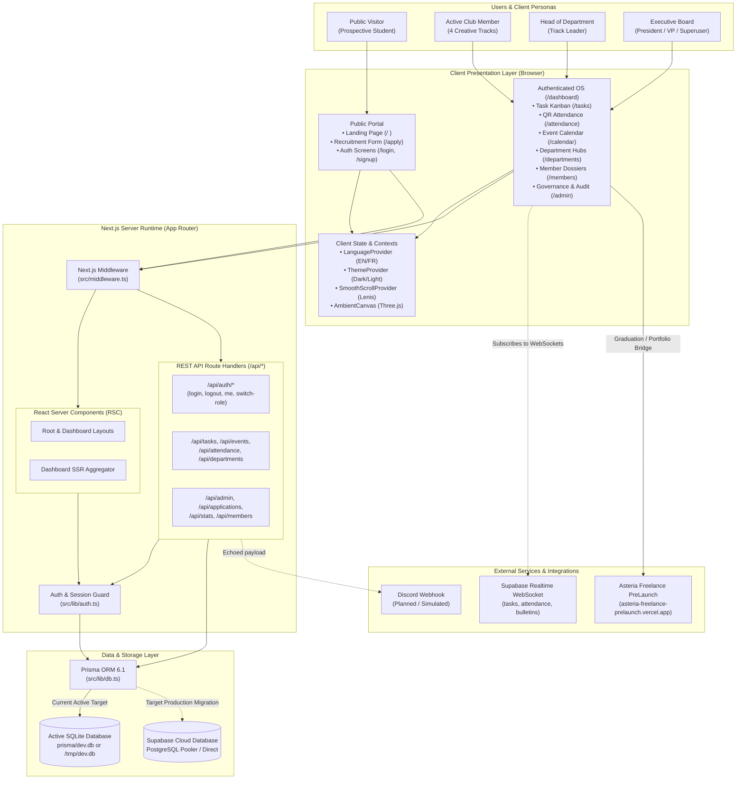
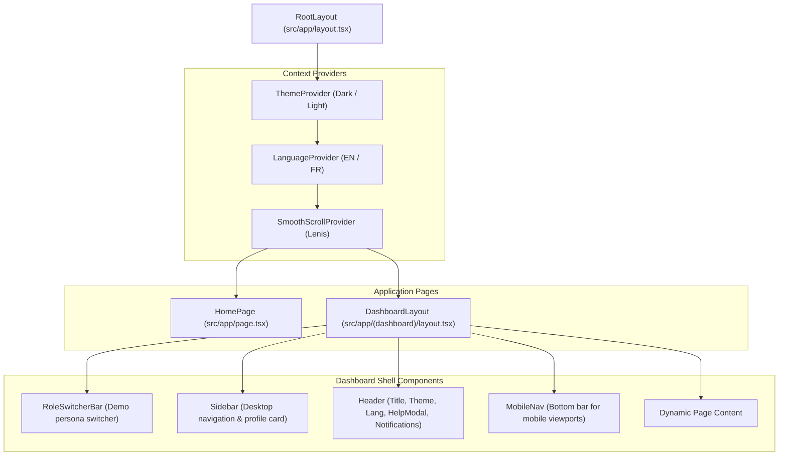
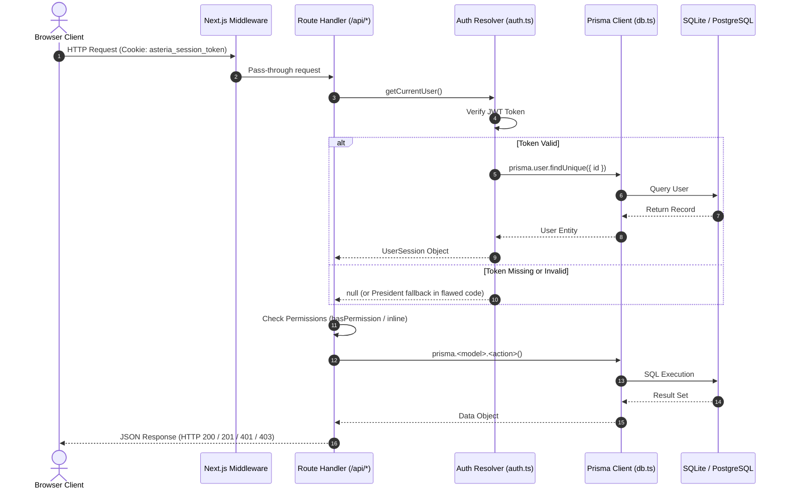
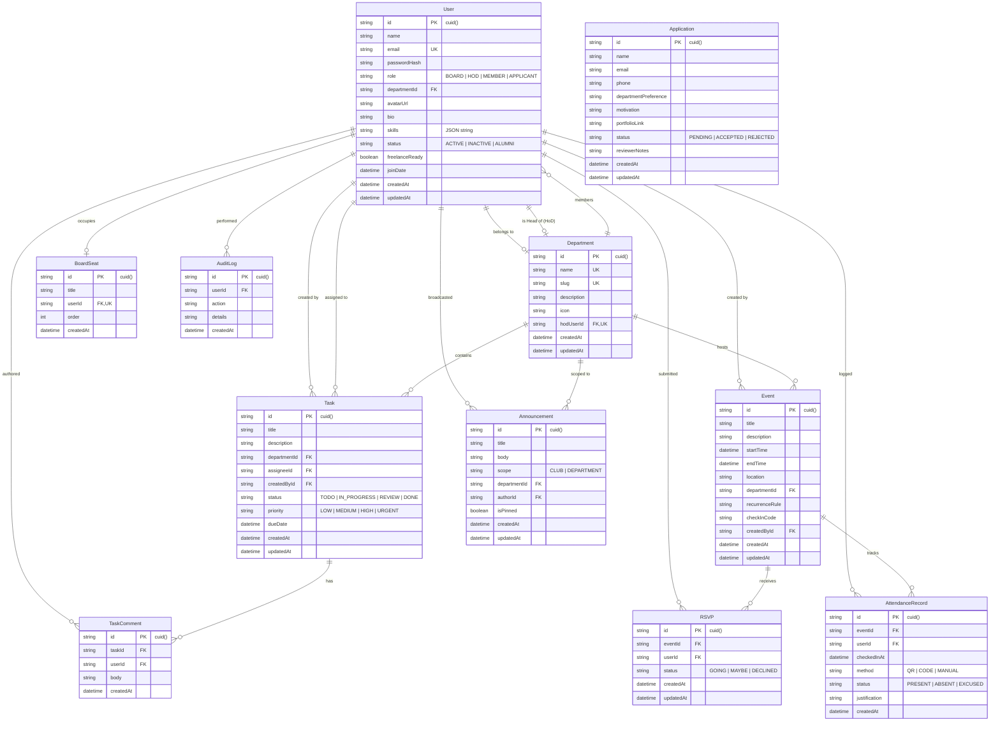
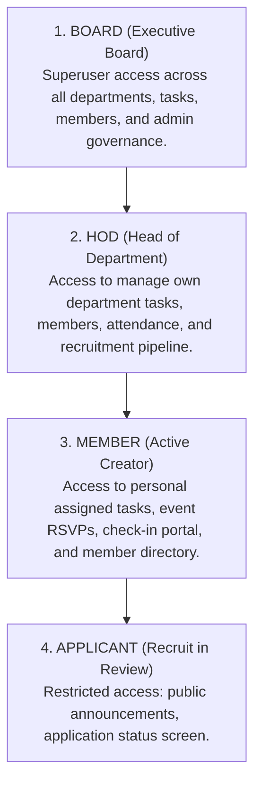
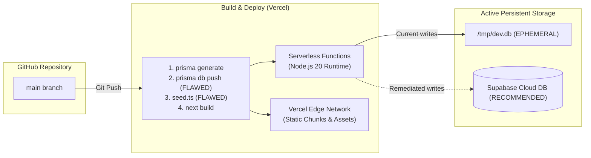

# Asteria Club Esprit — System Architecture Map

**System:** Asteria Club Esprit Management Platform & Incubator OS  
**Architecture Model:** Hybrid Serverless Full-Stack Web Application  
**Primary Framework:** Next.js 15 / 16 (App Router)  
**Database Model:** Dual-tier (Prisma ORM SQLite / Supabase PostgreSQL)  

---

## 1. High-Level System Architecture

---

## 2. Core Modules Breakdown

| Module | Route(s) | Primary Purpose | User Roles | Data Entities |
| :--- | :--- | :--- | :--- | :--- |
| **Public Showcase & FAQ** | `/` | Club brand introduction, specialization track highlights, curriculum, stats counters, and FAQ. | Public | `Department`, `Task`, `User` (aggregated) |
| **Recruitment Portal** | `/apply` | Public student application submission for seasonal recruitment. | Public / Applicant | `Application` |
| **Authentication & Persona** | `/login`, `/signup` | User login, JWT token minting, session cookie persistence. | All | `User`, `Department`, `BoardSeat` |
| **Executive & Member Dashboards** | `/dashboard` | Role-specific console: Board KPIs, HoD track sprint meters, Member assigned tickets and attendance health. | Board, HoD, Member, Applicant | All entities |
| **Task Kanban Board** | `/tasks` | 4-column agile sprint board (`TODO`, `IN_PROGRESS`, `REVIEW`, `DONE`), priorities, comments, and member assignments. | Board, HoD, Member | `Task`, `TaskComment`, `Department`, `User` |
| **Attendance & QR Check-In** | `/attendance` | Dynamic QR code generation, 6-digit passcode validation, camera simulation, absence justification. | Board, HoD, Member | `Event`, `AttendanceRecord`, `User` |
| **Shared Event Calendar** | `/calendar` | Scheduled workshops, general assemblies, conflict warnings, and 1-click RSVP (`GOING`, `MAYBE`, `DECLINED`). | Board, HoD, Member | `Event`, `RSVP`, `Department` |
| **Department Hubs & Org Chart** | `/departments`, `/departments/[id]` | Interactive hierarchical org chart (Tier 1 Board to Tier 2 Leads & members) and dedicated department sprint hubs. | Board, HoD, Member | `Department`, `BoardSeat`, `User`, `Task` |
| **Member Directory & Dossiers** | `/members`, `/members/[id]` | Searchable member catalog, skill tags, freelance readiness badges, and dossier profile editing. | Board, HoD, Member | `User`, `Department`, `AttendanceRecord` |
| **Announcements & Bulletins** | `/announcements` | Scoped broadcast notices (Club-wide vs Departmental), pinned bulletins, Discord embed preview. | All authenticated | `Announcement`, `Department`, `User` |
| **Recruitment Review & Onboarding** | `/applications` | Pipeline review of applicant portfolios and 1-click instant member provisioning. | Board, HoD | `Application`, `User`, `Department` |
| **System Governance & Audit** | `/admin` | Academic year cycle rollovers, board seat assignments, track management, and audit log inspection. | Board | `BoardSeat`, `Department`, `AuditLog` |

---

## 3. Frontend Architecture

### Component Hierarchy

### Design System Implementation
* **Design Token Configuration**: Defined in `tailwind.config.ts` adhering strictly to **Asteria Charte Graphique 2026 (v2.1)**.
* **Palette**:
  * Primary Accent: `teal-900` (`#11606E`)
  * Complementary Accent: `teal-400` (`#60C8D4`)
  * Dark Canvas: `ast-dark` (`#0A3A40`), `ast-darker` (`#062327`)
  * Text Ink: `ink` (`#12201F`), `ink-soft` (`#4B5C5C`), `ink-faint` (`#8A9695`)
* **Typography**:
  * Headings: `Exo 2` (`var(--font-exo2)`)
  * Body: `Plus Jakarta Sans` (`var(--font-jakarta)`)
  * Data/Monospace: `JetBrains Mono` (`var(--font-jetbrains)`)
* **Motion Tokens**:
  * `vague`: `cubic-bezier(0.16, 1, 0.3, 1)` (300ms modal entrances, card reveals)
  * `courant`: `cubic-bezier(0.65, 0, 0.35, 1)` (300ms tab switches, state transitions)
  * `maree`: `cubic-bezier(0.37, 0, 0.63, 1)` (500ms dismissals, collapses)

---

## 4. Backend Architecture & API Gateway

The backend is built using Next.js Route Handlers (`src/app/api/**/route.ts`).

### Request Lifecycle

---

## 5. Database Architecture

### Entity-Relationship Model

---

## 6. Authentication & Session Architecture

1. **Credentials Verification**: Passwords hashed with `bcryptjs` (salt rounds: 10).
2. **Session Token**: Signed JSON Web Token (JWT) containing `userId`, `email`, and `role`. Signed with `JWT_SECRET` (default 7-day expiration).
3. **Cookie Storage**: Stored in `asteria_session_token` cookie with flags `HttpOnly`, `Path=/`, `SameSite=Lax`. (Missing: `Secure=true` in production).
4. **Session Resolution Flow**:
   * API handlers call `getCurrentUser()`.
   * Reads cookie via `cookies().get("asteria_session_token")`.
   * Verifies JWT with `verifyToken()`.
   * Queries Prisma for live user data.

---

## 7. Authorization & Role-Based Access Control (RBAC)

The system defines 4 hierarchical personas:

---

## 8. External Services & Talent Bridge

1. **Asteria Freelance PreLaunch Bridge**:
   * URL: `https://asteria-freelance-prelaunch.vercel.app/`
   * Role: The primary commercial incubator target. Students completing sprint tickets and maintaining high attendance health receive the `freelanceReady: true` credential, qualifying them for paid commercial client contracts.
2. **Supabase Cloud (PostgreSQL / Auth / Realtime)**:
   * Target production database and realtime WebSocket service.
3. **Discord Integration**:
   * Documented as rich embed notification engine for `#announcements`. Currently implemented as a UI simulation without backend webhook dispatch.

---

## 9. Deployment & Infrastructure Architecture

* **Hosting Provider**: Vercel Serverless Platform
* **Serverless Caveat**: Because SQLite writes to `/tmp`, database state is not shared across Lambda invocations and resets upon cold restart. Migrating to Supabase PostgreSQL is required for persistent production deployment.
