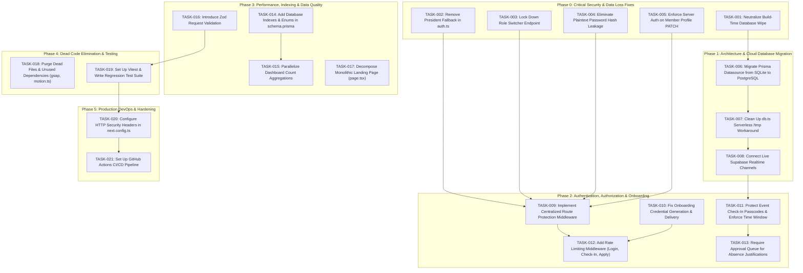

# Asteria Club Esprit — Project Audit Action Plan

**Repository:** `itshydraaaaaa/Asteria-Club-Esprit`  
**Execution Target:** Complete remediation of all identified audit findings  
**Strategy:** Security, Data Integrity, and Architectural Fixes Prioritized Over Cosmetic Changes

---

## Task Execution Sequence Matrix



---

## Detailed Task Catalog

### TASK-001: Neutralize Build-Time Database Wipe
* **Priority**: P0 — Critical
* **Title**: Remove destructive database seeding from production build script
* **Description**: The `package.json` build command currently executes `prisma db push --accept-data-loss && tsx prisma/seed.ts`, wiping out all data on every deployment.
* **Files Affected**:
  * [`package.json`](file:///c:/Users/MSI/Downloads/Asteria/Asteria%20Club/package.json)
* **Dependencies**: None
* **Implementation Steps**:
  1. Open `package.json`.
  2. Change script `"build": "prisma generate && prisma db push --accept-data-loss && tsx prisma/seed.ts && next build"` to `"build": "prisma generate && next build"`.
  3. Add `"db:deploy": "prisma migrate deploy"`.
  4. Ensure `"seed": "tsx prisma/seed.ts"` remains available for local development only.
* **Validation Method**:
  Run `npm run build` locally. Verify that existing records in `dev.db` are untouched.
* **Risk**: Low
* **Estimated Complexity**: Low (15 mins)
* **Status**: READY FOR IMPLEMENTATION

---

### TASK-002: Remove Default President Fallback in `getCurrentUser()`
* **Priority**: P0 — Critical
* **Title**: Eliminate automatic presidential administrative access for unauthenticated visitors
* **Description**: `src/lib/auth.ts` lines 31–42 query the first `"BOARD"` user and return it when no session cookie exists. Unauthenticated visitors are treated as the club President.
* **Files Affected**:
  * [`src/lib/auth.ts`](file:///c:/Users/MSI/Downloads/Asteria/Asteria%20Club/src/lib/auth.ts)
  * [`src/app/api/auth/me/route.ts`](file:///c:/Users/MSI/Downloads/Asteria/Asteria%20Club/src/app/api/auth/me/route.ts)
* **Dependencies**: None
* **Implementation Steps**:
  1. In `src/lib/auth.ts`, replace lines 31–42 with `if (!token) return null;`.
  2. In `src/app/api/auth/me/route.ts`, ensure that if `authUser` and `fallbackUser` are null, it returns `{ user: null }` with status 401.
  3. Test that accessing `/dashboard` without cookies redirects to `/login`.
* **Validation Method**:
  Send `GET /api/auth/me` with no cookies; verify HTTP status 401 with `{ "user": null }`.
* **Risk**: Low
* **Estimated Complexity**: Low (30 mins)
* **Status**: READY FOR IMPLEMENTATION

---

### TASK-003: Lock Down Role Switcher Endpoint in Production
* **Priority**: P0 — Critical
* **Title**: Gate `/api/auth/switch-role` behind development environment checks
* **Description**: The endpoint `/api/auth/switch-role` mints valid JWT session cookies for arbitrary roles or emails with zero credentials or permission checks.
* **Files Affected**:
  * [`src/app/api/auth/switch-role/route.ts`](file:///c:/Users/MSI/Downloads/Asteria/Asteria%20Club/src/app/api/auth/switch-role/route.ts)
* **Dependencies**: None
* **Implementation Steps**:
  1. In `src/app/api/auth/switch-role/route.ts`, add an immediate environment check:
     ```typescript
     if (process.env.NODE_ENV === "production" || process.env.NEXT_PUBLIC_DEMO_MODE !== "true") {
       return NextResponse.json({ error: "Role switcher is disabled in production environments" }, { status: 403 });
     }
     ```
  2. In production, prevent the endpoint from setting session cookies.
* **Validation Method**:
  Run in production mode (`NODE_ENV=production`) and send `POST /api/auth/switch-role`; verify HTTP status 403 Forbidden.
* **Risk**: Low
* **Estimated Complexity**: Low (15 mins)
* **Status**: READY FOR IMPLEMENTATION

---

### TASK-004: Eliminate Plaintext Password Hash Leakage
* **Priority**: P0 — Critical
* **Title**: Strip `passwordHash` from Prisma relation includes across all API routes
* **Description**: Multiple routes query user relations without projecting fields, exposing bcrypt password hashes to client responses.
* **Files Affected**:
  * [`src/app/api/departments/[id]/route.ts`](file:///c:/Users/MSI/Downloads/Asteria/Asteria%20Club/src/app/api/departments/%5Bid%5D/route.ts)
  * [`src/app/api/members/[id]/route.ts`](file:///c:/Users/MSI/Downloads/Asteria/Asteria%20Club/src/app/api/members/%5Bid%5D/route.ts)
  * [`src/app/api/events/route.ts`](file:///c:/Users/MSI/Downloads/Asteria/Asteria%20Club/src/app/api/events/route.ts)
  * [`src/app/api/events/[id]/rsvp/route.ts`](file:///c:/Users/MSI/Downloads/Asteria/Asteria%20Club/src/app/api/events/%5Bid%5D/rsvp/route.ts)
  * [`src/app/api/tasks/route.ts`](file:///c:/Users/MSI/Downloads/Asteria/Asteria%20Club/src/app/api/tasks/route.ts)
  * [`src/app/api/tasks/[id]/route.ts`](file:///c:/Users/MSI/Downloads/Asteria/Asteria%20Club/src/app/api/tasks/%5Bid%5D/route.ts)
* **Dependencies**: None
* **Implementation Steps**:
  1. In `src/app/api/departments/[id]/route.ts`:
     * Change `hod: true` to `hod: { select: { id: true, name: true, email: true, avatarUrl: true, role: true } }`.
     * Change `members: true` to `members: { select: { id: true, name: true, email: true, role: true, avatarUrl: true, skills: true, freelanceReady: true } }`.
  2. In `src/app/api/members/[id]/route.ts`:
     * On line 112, do not return `updated` directly; project a sanitized user object omitting `passwordHash`.
  3. In `src/app/api/events/route.ts` and `src/app/api/events/[id]/rsvp/route.ts`:
     * Change `createdBy: true` and `user: true` to select only `id`, `name`, `email`, `avatarUrl`, `role`.
  4. In `src/app/api/tasks/route.ts` and `src/app/api/tasks/[id]/route.ts`:
     * Project `assignee`, `createdBy`, and `comments.user` to exclude `passwordHash`.
* **Validation Method**:
  Query `GET /api/departments/web-development` and check that `passwordHash` is undefined in the JSON response.
* **Risk**: Low
* **Estimated Complexity**: Medium (2 hours)
* **Status**: READY FOR IMPLEMENTATION

---

### TASK-005: Enforce Server Authentication & Authorization on Member Profile Updates
* **Priority**: P0 — Critical
* **Title**: Protect `PATCH /api/members/[id]` against unauthenticated privilege escalation
* **Description**: `PATCH /api/members/[id]` currently lacks any authentication or role checks, allowing anonymous users to assign themselves or others the `"BOARD"` role.
* **Files Affected**:
  * [`src/app/api/members/[id]/route.ts`](file:///c:/Users/MSI/Downloads/Asteria/Asteria%20Club/src/app/api/members/%5Bid%5D/route.ts)
* **Dependencies**: TASK-002
* **Implementation Steps**:
  1. Call `const currentUser = await getCurrentUser();`.
  2. If `!currentUser`, return 401 Unauthorized.
  3. If `body.role !== undefined` or `body.status !== undefined` or `body.departmentId !== undefined`:
     * Require `currentUser.role === "BOARD"`. If not, return 403 Forbidden.
  4. If updating `name`, `bio`, or `skills`:
     * Allow only if `currentUser.id === id` OR `currentUser.role === "BOARD"`.
* **Validation Method**:
  Attempt `PATCH /api/members/<id>` with no cookies; verify 401. Attempt with a member user token changing `role: "BOARD"`; verify 403.
* **Risk**: Medium
* **Estimated Complexity**: Low (1 hour)
* **Status**: READY FOR IMPLEMENTATION

---

### TASK-006: Migrate Prisma Datasource from SQLite to PostgreSQL (Supabase)
* **Priority**: P0 — Critical
* **Title**: Configure production persistent PostgreSQL database on Supabase
* **Description**: The project currently uses SQLite (`dev.db`), which does not persist across serverless instances and prevents horizontal scalability.
* **Files Affected**:
  * [`prisma/schema.prisma`](file:///c:/Users/MSI/Downloads/Asteria/Asteria%20Club/prisma/schema.prisma)
  * [`.env`](file:///c:/Users/MSI/Downloads/Asteria/Asteria%20Club/.env)
  * [`.env.example`](file:///c:/Users/MSI/Downloads/Asteria/Asteria%20Club/.env.example)
* **Dependencies**: TASK-001
* **Implementation Steps**:
  1. In `prisma/schema.prisma`, update datasource block:
     ```prisma
     datasource db {
       provider  = "postgresql"
       url       = env("DATABASE_URL")
       directUrl = env("DIRECT_URL")
     }
     ```
  2. In `.env`, configure the valid Supabase PostgreSQL connection pooler and direct connection strings.
  3. Execute `npx prisma db push` or `npx prisma migrate dev` to create the schema on Supabase.
* **Validation Method**:
  Run a test query against Supabase PostgreSQL; verify table structures exist in Supabase dashboard.
* **Risk**: High (requires active Supabase credentials)
* **Estimated Complexity**: High (4 hours)
* **Status**: PENDING CONFIGURATION

---

### TASK-007: Clean Up `db.ts` Serverless `/tmp` Workaround
* **Priority**: P0 — Critical
* **Title**: Remove SQLite `/tmp` copying logic once PostgreSQL is configured
* **Description**: `src/lib/db.ts` contains fallback logic copying SQLite to `/tmp/dev.db` when running on Vercel/AWS Lambda.
* **Files Affected**:
  * [`src/lib/db.ts`](file:///c:/Users/MSI/Downloads/Asteria/Asteria%20Club/src/lib/db.ts)
* **Dependencies**: TASK-006
* **Implementation Steps**:
  1. Simplify `src/lib/db.ts` to instantiate a standard singleton `PrismaClient` using `process.env.DATABASE_URL`.
  2. Remove filesystem copying (`fs.copyFileSync`) and references to `/tmp/dev.db`.
* **Validation Method**:
  Start Next.js dev server and execute an API query; confirm Prisma connects via `DATABASE_URL`.
* **Risk**: Low
* **Estimated Complexity**: Low (30 mins)
* **Status**: DEPENDS ON TASK-006

---

### TASK-008: Connect Live Supabase Realtime Channels
* **Priority**: P1 — High
* **Title**: Ensure Supabase Realtime WebSocket events synchronize with PostgreSQL mutations
* **Description**: Realtime channels in `KanbanBoard.tsx`, `AttendanceHub.tsx`, and `AnnouncementsFeed.tsx` listen to PostgreSQL change events. Once the database is PostgreSQL on Supabase, ensure replication is enabled on tables.
* **Files Affected**:
  * Supabase Cloud Table Replication Settings
  * [`src/components/kanban/KanbanBoard.tsx`](file:///c:/Users/MSI/Downloads/Asteria/Asteria%20Club/src/components/kanban/KanbanBoard.tsx)
  * [`src/components/attendance/AttendanceHub.tsx`](file:///c:/Users/MSI/Downloads/Asteria/Asteria%20Club/src/components/attendance/AttendanceHub.tsx)
  * [`src/components/announcements/AnnouncementsFeed.tsx`](file:///c:/Users/MSI/Downloads/Asteria/Asteria%20Club/src/components/announcements/AnnouncementsFeed.tsx)
* **Dependencies**: TASK-006
* **Implementation Steps**:
  1. Enable Realtime publication in Supabase on `tasks`, `attendance_records`, and `announcements` (`ALTER PUBLICATION supabase_realtime ADD TABLE tasks, attendance_records, announcements;`).
  2. Test updating a task status in one browser window; verify that the second window updates instantly without refresh.
* **Validation Method**:
  Observe WebSocket message frames in browser DevTools Network tab when creating a task.
* **Risk**: Medium
* **Estimated Complexity**: Medium (2 hours)
* **Status**: DEPENDS ON TASK-006

---

### TASK-009: Implement Centralized Route Protection Middleware
* **Priority**: P1 — High
* **Title**: Enforce session verification and route access control in Next.js middleware
* **Description**: `src/middleware.ts` currently only refreshes Supabase session cookies and performs zero route protection. Unauthenticated users can access dashboard pages directly.
* **Files Affected**:
  * [`src/middleware.ts`](file:///c:/Users/MSI/Downloads/Asteria/Asteria%20Club/src/middleware.ts)
* **Dependencies**: TASK-002
* **Implementation Steps**:
  1. In `src/middleware.ts`, verify the `asteria_session_token` cookie for protected paths (`/dashboard`, `/tasks`, `/attendance`, `/calendar`, `/departments`, `/members`, `/applications`, `/admin`).
  2. If the token is invalid or missing, redirect to `/login?redirect=<path>`.
  3. If accessing `/admin`, verify that token payload has `role === "BOARD"`; redirect to `/dashboard` if unauthorized.
  4. If accessing `/applications`, verify `role === "BOARD" || role === "HOD"`.
* **Validation Method**:
  Open an incognito browser window and navigate to `/admin`; verify immediate redirection to `/login`.
* **Risk**: Medium
* **Estimated Complexity**: Medium (3 hours)
* **Status**: READY FOR IMPLEMENTATION

---

### TASK-010: Fix Onboarding Credential Generation & Delivery
* **Priority**: P1 — High
* **Title**: Provide accessible temporary credentials or an activation link upon applicant onboarding
* **Description**: When clicking "1-Click Auto-Onboard", a random password is generated and hashed, but never delivered to the recruit or administrator.
* **Files Affected**:
  * [`src/app/api/applications/[id]/onboard/route.ts`](file:///c:/Users/MSI/Downloads/Asteria/Asteria%20Club/src/app/api/applications/%5Bid%5D/onboard/route.ts)
  * [`src/components/recruitment/ApplicationsPipeline.tsx`](file:///c:/Users/MSI/Downloads/Asteria/Asteria%20Club/src/components/recruitment/ApplicationsPipeline.tsx)
* **Dependencies**: None
* **Implementation Steps**:
  1. In `onboard/route.ts`, return `temporaryPassword: secureTemporaryPassword` in the JSON response to the Board member initiating onboarding.
  2. In `ApplicationsPipeline.tsx`, display a modal dialog with the recruit's email and temporary password so the Board member can copy and send it.
  3. (Optional) Integrate transactional email dispatch via Resend.
* **Validation Method**:
  Click "Auto-Onboard" on a pending recruit; verify modal pop-up displays the generated password and allows copying.
* **Risk**: Low
* **Estimated Complexity**: Medium (2 hours)
* **Status**: READY FOR IMPLEMENTATION

---

### TASK-011: Protect Event Check-In Passcodes & Enforce Time Windows
* **Priority**: P1 — High
* **Title**: Strip `checkInCode` from public API responses and enforce active session time window
* **Description**: `GET /api/events` exposes check-in passcodes to all visitors, and `check-in/route.ts` allows check-ins to any event at any time without validation.
* **Files Affected**:
  * [`src/app/api/events/route.ts`](file:///c:/Users/MSI/Downloads/Asteria/Asteria%20Club/src/app/api/events/route.ts)
  * [`src/app/api/attendance/check-in/route.ts`](file:///c:/Users/MSI/Downloads/Asteria/Asteria%20Club/src/app/api/attendance/check-in/route.ts)
* **Dependencies**: TASK-002
* **Implementation Steps**:
  1. In `src/app/api/events/route.ts`, do not return `checkInCode` unless the requester is the event creator, an HoD, or a Board member.
  2. In `src/app/api/attendance/check-in/route.ts`:
     * Require a valid `code`. Remove the backdoor permitting check-in with `{ eventId }` only.
     * Check that `now >= event.startTime - 15 minutes` and `now <= event.endTime + 30 minutes`.
* **Validation Method**:
  Fetch `/api/events` unauthenticated; confirm `checkInCode` is omitted. Attempt check-in for an event outside its time window; confirm error.
* **Risk**: Low
* **Estimated Complexity**: Medium (2 hours)
* **Status**: READY FOR IMPLEMENTATION

---

### TASK-012: Add Rate Limiting Middleware
* **Priority**: P1 — High
* **Title**: Prevent brute-force attacks on login, check-in, and application submission
* **Description**: All API routes are vulnerable to automated high-frequency abuse.
* **Files Affected**:
  * [`src/lib/rateLimit.ts`](file:///c:/Users/MSI/Downloads/Asteria/Asteria%20Club/src/lib/rateLimit.ts) (NEW)
  * [`src/app/api/auth/login/route.ts`](file:///c:/Users/MSI/Downloads/Asteria/Asteria%20Club/src/app/api/auth/login/route.ts)
  * [`src/app/api/attendance/check-in/route.ts`](file:///c:/Users/MSI/Downloads/Asteria/Asteria%20Club/src/app/api/attendance/check-in/route.ts)
  * [`src/app/api/applications/route.ts`](file:///c:/Users/MSI/Downloads/Asteria/Asteria%20Club/src/app/api/applications/route.ts)
* **Dependencies**: None
* **Implementation Steps**:
  1. Create an in-memory or Redis-backed rate limiter utility in `src/lib/rateLimit.ts`.
  2. Configure limits:
     * `/api/auth/login`: 5 attempts per IP per 5 minutes.
     * `/api/attendance/check-in`: 10 attempts per user per 5 minutes.
     * `/api/applications`: 3 submissions per IP per hour.
* **Validation Method**:
  Send 6 rapid requests to `/api/auth/login`; verify the 6th returns HTTP 429 Too Many Requests.
* **Risk**: Low
* **Estimated Complexity**: Medium (3 hours)
* **Status**: READY FOR IMPLEMENTATION

---

### TASK-013: Require Approval Queue for Absence Justifications
* **Priority**: P2 — Medium
* **Title**: Transition absence justification into an approval flow
* **Description**: `src/app/api/attendance/justify/route.ts` immediately excuses absences without review.
* **Files Affected**:
  * [`src/app/api/attendance/justify/route.ts`](file:///c:/Users/MSI/Downloads/Asteria/Asteria%20Club/src/app/api/attendance/justify/route.ts)
  * [`src/components/attendance/AttendanceHub.tsx`](file:///c:/Users/MSI/Downloads/Asteria/Asteria%20Club/src/components/attendance/AttendanceHub.tsx)
* **Dependencies**: None
* **Implementation Steps**:
  1. Update `status` to `"EXCUSED_PENDING"` instead of `"EXCUSED"`.
  2. Add an approval/rejection button in `AttendanceHub.tsx` visible only to HoDs and Board members.
* **Validation Method**:
  Submit a justification; verify status shows as pending until approved by HoD.
* **Risk**: Low
* **Estimated Complexity**: Medium (3 hours)
* **Status**: READY FOR IMPLEMENTATION

---

### TASK-014: Add Database Indexes & Enums in `schema.prisma`
* **Priority**: P2 — Medium
* **Title**: Optimize query execution plans and enforce data integrity constraints
* **Description**: Frequent filter and foreign key columns lack indexes; string columns allow arbitrary values.
* **Files Affected**:
  * [`prisma/schema.prisma`](file:///c:/Users/MSI/Downloads/Asteria/Asteria%20Club/prisma/schema.prisma)
* **Dependencies**: TASK-006
* **Implementation Steps**:
  1. Define enums: `Role`, `UserStatus`, `TaskStatus`, `TaskPriority`, `AttendanceStatus`, `AttendanceMethod`, `ApplicationStatus`.
  2. Add `@@index([departmentId])`, `@@index([assigneeId])`, `@@index([status])` to `Task`.
  3. Add `@@index([startTime])`, `@@unique([checkInCode])` to `Event`.
  4. Add `@@index([status])`, `@@index([checkedInAt])` to `AttendanceRecord`.
* **Validation Method**:
  Run `prisma validate` followed by `prisma migrate dev`.
* **Risk**: Medium (schema change)
* **Estimated Complexity**: Medium (2 hours)
* **Status**: DEPENDS ON TASK-006

---

### TASK-015: Parallelize Dashboard Count Aggregations
* **Priority**: P2 — Medium
* **Title**: Optimize dashboard load latency by executing queries concurrently
* **Description**: `src/app/api/dashboard/route.ts` executes 8 serial queries.
* **Files Affected**:
  * [`src/app/api/dashboard/route.ts`](file:///c:/Users/MSI/Downloads/Asteria/Asteria%20Club/src/app/api/dashboard/route.ts)
  * [`src/app/(dashboard)/dashboard/page.tsx`](file:///c:/Users/MSI/Downloads/Asteria/Asteria%20Club/src/app/%28dashboard%29/dashboard/page.tsx)
* **Dependencies**: None
* **Implementation Steps**:
  1. Wrap independent count queries in `Promise.all([ ... ])`:
     ```typescript
     const [totalMembers, totalDepartments, pendingApplications, totalTasks, completedTasks, totalEvents, totalAttendance] = await Promise.all([
       prisma.user.count({ where: { status: "ACTIVE" } }),
       prisma.department.count(),
       prisma.application.count({ where: { status: "PENDING" } }),
       prisma.task.count(),
       prisma.task.count({ where: { status: "DONE" } }),
       prisma.event.count(),
       prisma.attendanceRecord.count({ where: { status: "PRESENT" } }),
     ]);
     ```
* **Validation Method**:
  Benchmark response time of `/api/dashboard`; verify latency reduction of >50%.
* **Risk**: Low
* **Estimated Complexity**: Low (1 hour)
* **Status**: READY FOR IMPLEMENTATION

---

### TASK-016: Introduce Zod Request Validation
* **Priority**: P2 — Medium
* **Title**: Validate all HTTP request bodies against strict schemas
* **Description**: APIs accept arbitrary JSON payloads without type, range, or length validation.
* **Files Affected**:
  * `package.json` (add `zod`)
  * `src/lib/validation/schemas.ts` (NEW)
  * All route handlers under `src/app/api/`
* **Dependencies**: None
* **Implementation Steps**:
  1. Install `zod`.
  2. Create schemas for `loginSchema`, `applicationSchema`, `taskSchema`, `eventSchema`, `commentSchema`.
  3. Parse requests with `.safeParse()`; return 400 with structured validation errors if invalid.
* **Validation Method**:
  Send invalid payloads (e.g. malformed email or task title > 255 chars); verify 400 Bad Request.
* **Risk**: Low
* **Estimated Complexity**: Medium (4 hours)
* **Status**: READY FOR IMPLEMENTATION

---

### TASK-017: Decompose Monolithic Landing Page (`src/app/page.tsx`)
* **Priority**: P3 — Low
* **Title**: Modularize 742-line homepage into discrete section components
* **Description**: `src/app/page.tsx` is difficult to maintain and bundles excessive code into a single file.
* **Files Affected**:
  * [`src/app/page.tsx`](file:///c:/Users/MSI/Downloads/Asteria/Asteria%20Club/src/app/page.tsx)
  * `src/components/home/HeroSection.tsx` (NEW)
  * `src/components/home/TracksSection.tsx` (NEW)
  * `src/components/home/PillarsSection.tsx` (NEW)
  * `src/components/home/FaqSection.tsx` (NEW)
  * `src/components/home/FooterSection.tsx` (NEW)
* **Dependencies**: None
* **Implementation Steps**:
  1. Extract sections into individual files in `src/components/home/`.
  2. Import and assemble them cleanly in `src/app/page.tsx`.
* **Validation Method**:
  Verify visual parity of the homepage in both light and dark mode.
* **Risk**: Low
* **Estimated Complexity**: Medium (3 hours)
* **Status**: READY FOR IMPLEMENTATION

---

### TASK-018: Purge Dead Files & Unused Dependencies
* **Priority**: P3 — Low
* **Title**: Remove unused files (`motion.ts`, `gsap`) to reduce repository bloat
* **Description**: `src/lib/motion.ts` is never imported; `gsap` is in `package.json` but never used.
* **Files Affected**:
  * [`package.json`](file:///c:/Users/MSI/Downloads/Asteria/Asteria%20Club/package.json)
  * [`src/lib/motion.ts`](file:///c:/Users/MSI/Downloads/Asteria/Asteria%20Club/src/lib/motion.ts)
* **Dependencies**: None
* **Implementation Steps**:
  1. Delete `src/lib/motion.ts`.
  2. Run `npm uninstall gsap`.
* **Validation Method**:
  Run `npm run build`; confirm successful compilation without errors.
* **Risk**: Low
* **Estimated Complexity**: Low (15 mins)
* **Status**: READY FOR IMPLEMENTATION

---

### TASK-019: Set Up Vitest & Write Core Regression Test Suite
* **Priority**: P2 — Medium
* **Title**: Establish automated testing for authentication, authorization, and data services
* **Description**: The repository contains zero tests.
* **Files Affected**:
  * `package.json` (add `vitest`, `@testing-library/react`)
  * `vitest.config.ts` (NEW)
  * `tests/auth.test.ts` (NEW)
  * `tests/permissions.test.ts` (NEW)
  * `tests/validation.test.ts` (NEW)
* **Dependencies**: TASK-002, TASK-005, TASK-016
* **Implementation Steps**:
  1. Install Vitest.
  2. Write unit tests verifying that unauthenticated requests return null/401.
  3. Write tests verifying that member role cannot update another member's role.
* **Validation Method**:
  Run `npx vitest run`; verify all tests pass.
* **Risk**: Low
* **Estimated Complexity**: Medium (4 hours)
* **Status**: READY FOR IMPLEMENTATION

---

### TASK-020: Configure HTTP Security Headers in `next.config.ts`
* **Priority**: P2 — Medium
* **Title**: Implement Content-Security-Policy, HSTS, X-Frame-Options, and nosniff
* **Description**: `next.config.ts` has no headers configuration.
* **Files Affected**:
  * [`next.config.ts`](file:///c:/Users/MSI/Downloads/Asteria/Asteria%20Club/next.config.ts)
* **Dependencies**: None
* **Implementation Steps**:
  1. In `next.config.ts`, implement `async headers()` returning:
     * `Strict-Transport-Security`: `max-age=63072000; includeSubDomains; preload`
     * `X-Content-Type-Options`: `nosniff`
     * `X-Frame-Options`: `DENY`
     * `Referrer-Policy`: `strict-origin-when-cross-origin`
     * `Permissions-Policy`: `camera=(self), microphone=(), geolocation=()`
* **Validation Method**:
  Inspect response headers using `curl -I http://localhost:3000`; verify security headers exist.
* **Risk**: Low
* **Estimated Complexity**: Low (30 mins)
* **Status**: READY FOR IMPLEMENTATION

---

### TASK-021: Set Up GitHub Actions CI/CD Pipeline
* **Priority**: P3 — Low
* **Title**: Automate linting, type-checking, and test execution on pull requests
* **Description**: No CI automation exists.
* **Files Affected**:
  * `.github/workflows/ci.yml` (NEW)
* **Dependencies**: TASK-019
* **Implementation Steps**:
  1. Create `.github/workflows/ci.yml`.
  2. Configure jobs to run `npm ci`, `npx prisma generate`, `npm run lint`, `npx tsc --noEmit`, and `npx vitest run`.
* **Validation Method**:
  Trigger workflow via git commit/push; verify GitHub Actions executes and passes.
* **Risk**: Low
* **Estimated Complexity**: Low (1 hour)
* **Status**: READY FOR IMPLEMENTATION
